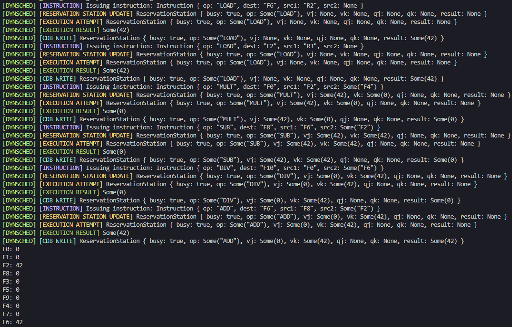

# Dynamic Scheduling -> Instruction Scheduler Simulation

This project implements an instruction scheduler using dynamic scheduling based on Tomasulo’s Algorithm. The algorithm handles out-of-order execution of instructions to optimize the use of the CPU and improve performance.

## Key Concepts

### Tomasulo’s Algorithm

Tomasulo's Algorithm is a hardware algorithm for dynamic scheduling of instructions that allows out-of-order execution and eliminates data hazards by using register renaming. The algorithm consists of:

- **Reservation Stations:** Hold instructions that are waiting to execute, including their operands and operation type.
- **Register Status Table:** Keeps track of which reservation station (if any) will write to each register.
- **Common Data Bus (CDB):** Broadcasts results to all reservation stations and registers, enabling register renaming and avoiding write-after-write (WAW) and write-after-read (WAR) hazards.

## Input:

| Instruction | Destination | Source 1 | Source 2 |
|-------------|--------------|----------|----------|
| LOAD        | F6           | R2       | None     |
| LOAD        | F2           | R3       | None     |
| MULT        | F0           | F2       | F4       |
| SUB         | F8           | F6       | F2       |
| DIV         | F10          | F0       | F2       |
| ADD         | F6           | F8       | F2       |

## Output:

| Register | Value |
|----------|-------|
| F0       | 0     |
| F1       | 0     |
| F2       | 42    |
| F3       | 0     |
| F4       | 0     |
| F5       | 0     |
| F6       | 42    |
| F7       | 0     |
| F8       | 0     |
| F9       | 0     |
| F10      | 0     |